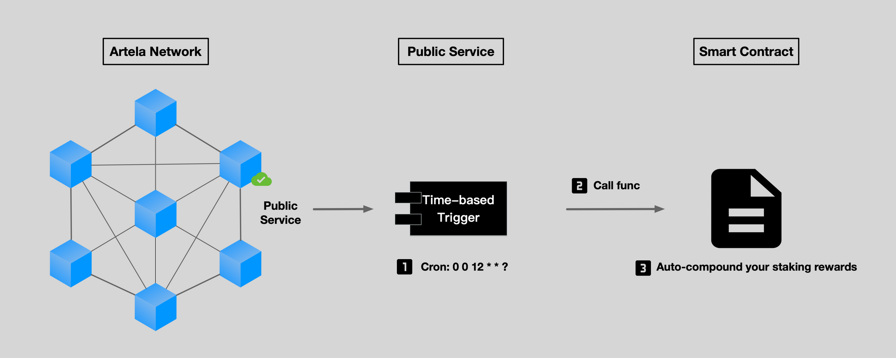

# Public Service

## 1. Introduction

At Artela Network, Public Service is a public infrastructure service built by developers through Aspect, which allows developers to share and integrate.

Public Service is a public service component built by developers based on Aspect. Developers can choose to make their component source code public and share it with other developers or community. At the same time, when building their own dApps, developers can choose to integrate mature public service components shared by other developers to reduce their own development costs and improve development efficiency.

Public Service is the technical implementation of modular pattern. Artela provides an economic incentive model for Public Service developers. As more and more excellent public service components settle, developers and communities will benefit from it.

The principle of Public Service in Artela Network is shown in the figure below:

---

## 2. Use Case

Among many Defi protocols, it is common for users to stake governance tokens to earn profits and share the profits with DAOs. As Smart Contracts do not have the ability to execute on a schedule, users who want to maximize their profits need to deploy services outside the chain to trigger Smart Contracts for auto-compound staking rewards. Deploying services outside of the chain in this way will bring additional security issues and also lose real-time performance.

Developers can use Aspect to build native Smart Contract timers within Artela Network, for example, a daily trigger at 12:00 to implement a compound staking profit aggregator. Artela Network ensures the security of public services, and because it is based on on-chain native implementation, it is more accurate and real-time compared to off-chain deployed services.

This model of building public services is called Public Service in Artela Network, as illustrated below:

