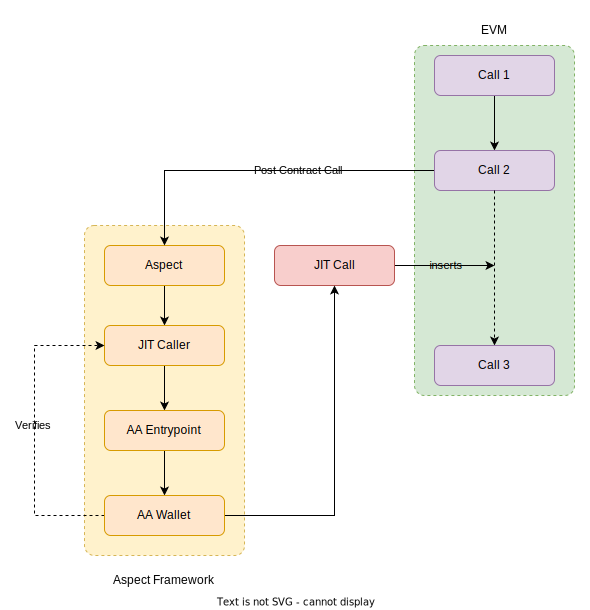

# JIT(Just In Time) Call

Aspect can insert additional contract calls into the current EVM callstack at Contract Call Level Join Points. This operation is known as **Just-In-Time (JIT) Call**. With this capability, dApps can make call-level real-time decisions. For instance, they can provide just-in-time liquidity to a DEX pool and etc. The sender of the JIT call must be an AA (Account Abstraction) wallet, and this wallet must have authorized the given Aspect to perform such an operation. For more details about AA wallets, please refer to the documentation on [Account Abstraction](advanced-concepts/account-abstraction).

## How to Make a JIT Call?

To initiate a JIT call, ensure that the sender is an Aspect-enabled AA wallet. Then, proceed as follows:

```typescript
import { sys } from "@artela/aspect-libs";

// ...
// Build JIT request (similar to the user operation defined in EIP-4337)
let request = new JitInherentRequest(
    walletAddress,        // The account initiating the operation
    nonce,                // Anti-replay parameter
    initCode,             // The initCode of the account (necessary if and only if the account is not yet on-chain and needs to be created)
    calldata,             // The amount of gas to allocate to the main execution call
    callGasLimit,         // The amount of gas to allocate for the verification step
    verificationGasLimit, // The amount of gas to pay to compensate the bundler for pre-verification execution, calldata, and any gas overhead that can’t be tracked on-chain
    maxFeePerGas,         // Maximum fee per gas (similar to EIP-1559 max_fee_per_gas)
    maxPriorityFeePerGas, // Maximum priority fee per gas (similar to EIP-1559 max_priority_fee_per_gas)
    paymasterAndData,     // Address of paymaster sponsoring the transaction, followed by extra data to send to the paymaster (empty for self-sponsored transactions)
);
// Submit the JIT call
let response = sys.evm.jitCall(ctx).submit(request);
// Check whether the call has been successfully submitted
sys.require(response.success, 'Failed to submit the JIT call');
// ...
```

The above code triggers the following operations:



1. Initiating a JIT call in Aspect sends the corresponding request to the JIT Caller system module in the Aspect framework.
2. The JIT Caller packs the request into a user operation and forwards it to the AA entrypoint.
3. The AA entrypoint verifies the user operation with the sender's AA wallet.
4. If the sender's AA wallet supports Aspect verification, it initiates a verification request to the pre-compiled contract at `0x65` in the Artela EVM.
5. If verification is successful, the JIT call is inserted into the EVM callstack.

:::note
Please note that the JIT call may fail if verification is unsuccessful (e.g., due to insufficient gas) or if the sender's AA wallet does not support Aspect verification. Ensure to handle these cases in your Aspect code.
:::
