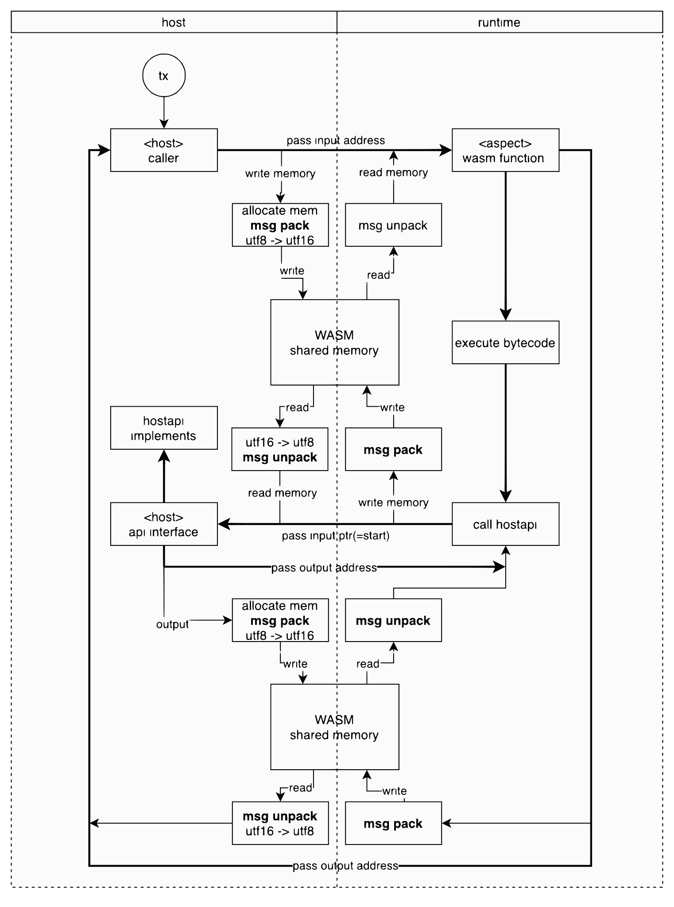

# Aspect Runtime

The Aspect runtime serves as a specialized WASM virtual machine, tailor-made for executing Aspect. Its initial version uses [WASMTime](https://github.com/bytecodealliance/wasmtime), a robust and swift WebAssembly implementation crafted in Rust.

A bridge between the core WASM VM and blockchain system modules, the Aspect runtime integrates a set of host APIs. These are meticulously curated to empower Aspect with interactive capabilities, ensuring seamless communication with the blockchain system modules. For a deeper dive into our host API specifics, please refer to our [Runtime Low-level API](/) section.

## Workflow

To better understand the mechanics of how the runtime executes an Aspect and its mode of communication with the blockchain system modules, consider the diagram below:

The conduit for data exchange between WASM and the host is a limited set of host APIs. Both the host and the WASM VM utilize a shared memory space managed by the Aspect runtime to establish communication. While the current message transmission protocol between WASM and the host relies on proto buffer encoding, we're also exploring a binary format to further minimize overheads.

## Isolation

The Aspect runtime is conceived as a sandbox environment. Each execution of an Aspect instantiates a fresh runtime, ensuring that every Aspect operation remains isolated. Consequently, any anomalies during Aspect execution impact only its state, leaving other modules, smart contracts, and Aspects unaffected.

## Gas

Aspect execution is not exempt from gas costs. While integrating Aspect into your dApp might introduce some additional overheads, rest assured that our focus remains on optimizing these costs.

To shed light on the gas mechanics:

1. Gas costs predominantly represent the CPU time required for program execution. For reference, 1 second of CPU execution equates to 10 million gas in Ethereum.
2. Ethereum has meticulously gauged the CPU cycles needed for specific op codes, assigning each a justifiable gas cost.

In Artela, to ensure a seamless integration with EVM's established gas system, the Aspect runtime adopts Ethereum's assumption (`1 CPU Sec == 1 million gas`). Notably, the performance of the Aspect Runtime significantly surpasses EVM (boasting about a 10x edge for 256-bit computations. For comprehensive data, please consult section 8.1 in our [white paper](https://github.com/artela-network/aspect-whitepaper/blob/main/latex/build/whitepaper.pdf)). As a result, the gas expenses associated with Aspect can be 10x ~ 100x lower comparing with EVM contracts when implementing similar logic.

We're still refining the specific gas rules, and we'll ensure this section is updated once they are finalized.
