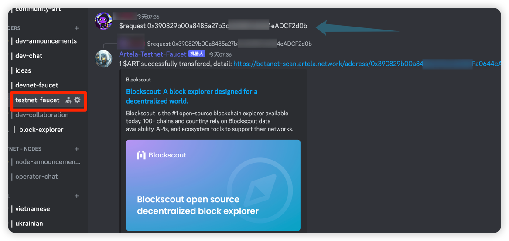

# Wallet Configuration

Artela is a blockchain compatible with the Ethereum Virtual Machine (EVM), and it supports all wallets compatible with
the EVM. Here are the steps, using `MetaMask` as an example, to configure the network and claim test tokens:

## Pre-requisites

* [Metamask](https://metamask.io/)

## 1. Open MetaMask

Launch the MetaMask extension or application.

## 2. Connect MetaMask to Artela TestNet

If you're new to MetaMask, follow this guide
on [How Add a Custom Network RPC](https://support.metamask.io/hc/en-us/articles/360043227612-How-to-add-a-custom-network-RPC)
for detailed instructions. 

chick  `Networks` > `Add a network` > `Add a network manually`

```
Network Name : artela betanet
New RPC URL : https://betanet-rpc1.artela.network
ChainID (optional): 11822
Symbol (optional) : ART
Block Explorer URL (optional): https://betanet-scan.artela.network/
```

For more info about the new RPC URL configuration, refer to [artela betanet](../node/access-betanet).

Ensure all fields are correctly filled:


## 3. Access TestNet Faucet

Join Artela [Discord server](https://discord.com/invite/artela) to access the Testnet ART faucet.
Request access and obtain Testnet ART with your wallet address.

```shell
$request {address}
```



Once you've completed these steps, your MetaMask is configured to interact with the Artela blockchain, and you have claimed test tokens on that network.
