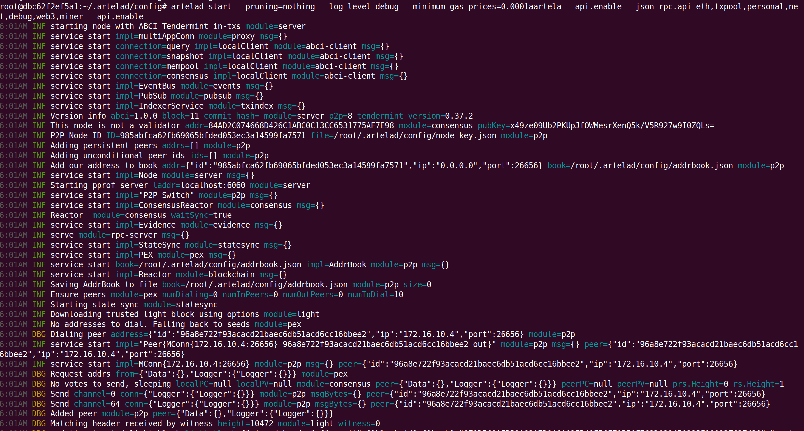
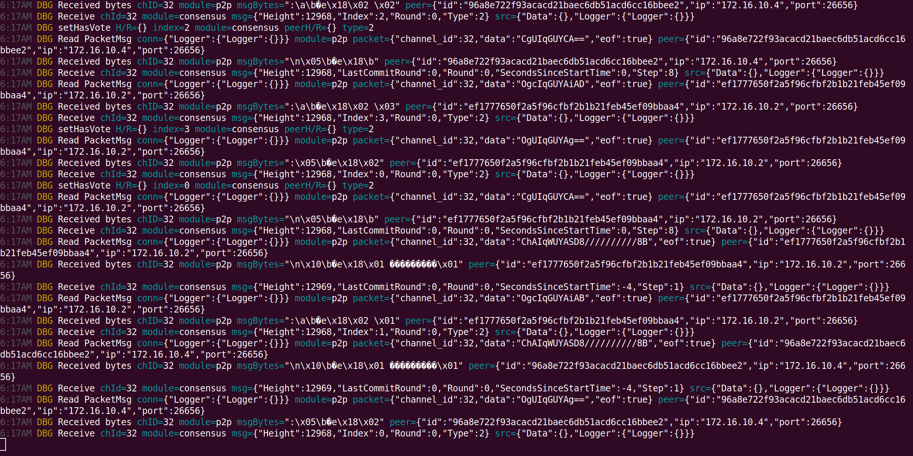

# Join TestNet

This document provides an introduction to joining the Artela Testnet as a full node.

**Hardware Minimum Requirements**

- CPU with 2+ cores

- 4GB RAM

- 1TB free storage space to sync the Testnet

- 8 MBit/sec download Internet service

**Recommended:**

- Fast CPU with 4+ cores

- 16GB+ RAM

- High-performance SSD with at least 1TB of free space

- 25+ MBit/sec download Internet service


## 1. Prepare Artelad

You can start with install artelad or build source code

### Option 1: Build the source.

### 1). Prepare the development tools

**Skip** this if you have already got your go development environment.

```bash
sudo apt-get update
sudo apt-get install -y make gcc
wget https://go.dev/dl/go1.20.3.linux-amd64.tar.gz
sudo rm -rf /usr/local/go && sudo tar -C /usr/local -xzf go1.20.3.linux-amd64.tar.gz
export PATH=$PATH:/usr/local/go/bin
```

You need to create a folder to store your source files, for example, `/home/user1/go/src`. Replace `user1` to your account, e.g. `ubuntu`.
```bash
mkdir -p /home/user1/go/sr
```
Then, set `/home/user1/go` as the GOPATH by using the following command: 
```bash
export GOPATH=/home/user1/go
```
This ensures that the necessary Go environment variables are configured correctly.

### 2). Clone and build the code

```bash
cd $GOPATH/src
git clone https://github.com/artela-network/artela
# git clone https://github.com/artela-network/artela-cosmos-sdk
# git clone https://github.com/artela-network/artela-cometbft
cd artela

git checkout main
make clean && make
cp ./build/artelad $HOME/go/bin/.
export PATH=$PATH:$HOME/go/bin
```

### Option 2: Download and Install Artelad

Ask admin of Artela Testnet for the download link.

Uninstall and copy the binaray `artelad` to `/usr/local/bin`.

## 2. Init node

**1). Init**

```bash
artelad init <custom_moniker> # e.g artelad init test111
```

**2). Copy genesis from [genesis.json](./genesis.json), and move to the home directory.**

```bash
mv genesis.json $HOME/.artelad/config/genesis.json
```

**3). Configure**

Get presistent seeds from [2. Presistent nodes](./access-testnet#public-information-on-testnet)

Add two of them to `seeds` in `app.toml`

```bash
cd $HOME/.artelad/config
# e.g sed -i 's/seeds = ""/seeds = "ef1777650f2a5f96cfbf2b1b21feb45ef09bbaa4@172.16.10.2:26656,96a8e722f93acacd21baec6db51acd6cc16bbee2@172.16.10.4:26656"/' config.toml
sed -i 's/seeds = ""/seeds = "<node-id-1@node-1-ip:port>,<node-id-2@node-2-ip:port>"/' config.toml
```

## 3. Set state sync

```bash
cd $HOME/.artelad/config
sed -i 's/enable = false/enable = true/' config.toml
sed -i 's/trust_height = 0/trust_height = <BLOCK_HEIGHT>/' config.toml
sed -i 's/trust_hash = ""/trust_hash = "<BLOCK_HASH>"/' config.toml

# e.g sed -i 's/rpc_servers = ""/rpc_servers = "172.16.10.2:26657,172.16.10.4:26657"/' config.toml
sed -i 's/rpc_servers = ""/rpc_servers = "node-1-ip:port,node-2-ip:port"/' config.toml
```

Get `BLOCK_HEIGHT` and `BLOCK_HASH` from [3. Trust block and height](./access-testnet#public-information-on-testnet)

Get `rpc_servers` from [4. RPC servers](./access-testnet#public-information-on-testnet##RPC-servers)

### 4. Run Artela node

```bash
export PATH=$PATH:$HOME/go/bin

artelad start --log_level debug
```

**Optional:  Run Artela node as a background service**

Run the Artela node with nohup and redirect the output to a log file. You can use a command like this:

```bash
nohup artelad start --log_level debug > artela.log 2>&1 &
```
* `nohup` is used to run a command in the background and detach it from the terminal.
* `artela start` is the command to start the Artela node.
* `> artela.log` redirects the standard output to a file named artela.log.
* `2>&1` redirects standard error to the same file as standard output.
* `&` at the end of the command runs it in the background.

After running the command, your Artela node should start as a background service, and its output will be logged to the `artela.log` file.

You can check the log file to view the Artela node's output using a command like this:
```bash
tail -f artela.log
```
The `tail -f` command allows you to continuously monitor the log file and see new log entries as they are written.

### 5. Output



When it syncs with all blocks, the output looks like:


