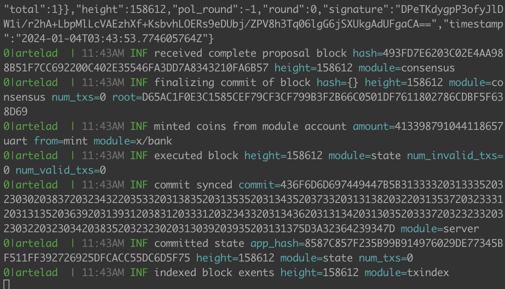

# Run a full node

This document provides an introduction to joining the Artela Testnet as a full node.
> It is recommended to use `ubuntu` operating system.

**Hardware Recommended Requirements:**

- 8 CPU Cores

- 16GB of Memory

- 1TB SSD

- 200mbps Network Bandwidth

## 1. Prepare artelad

You can start with install artelad or build source code

### Option 1: Build the source.

### 1). Prepare the development tools

**Skip** this if you have already got your go development environment.

```bash
sudo apt-get update
sudo apt-get install -y make gcc
wget https://go.dev/dl/go1.20.3.linux-amd64.tar.gz
sudo rm -rf /usr/local/go && sudo tar -C /usr/local -xzf go1.20.3.linux-amd64.tar.gz
export PATH=$PATH:/usr/local/go/bin
```

You need to create a folder to store your source files, for example, `/home/user1/go/src`. Replace `user1` to your account, e.g. `ubuntu`.
```bash
mkdir -p /home/user1/go/sr
```
Then, set `/home/user1/go` as the GOPATH by using the following command: 
```bash
export GOPATH=/home/user1/go
```
This ensures that the necessary Go environment variables are configured correctly.

### 2). Clone and build the code

```bash
cd $GOPATH/src
git clone https://github.com/artela-network/artela
# git clone https://github.com/artela-network/artela-cosmos-sdk
# git clone https://github.com/artela-network/artela-cometbft
cd artela

git checkout main
make clean && make
cp ./build/artelad $HOME/go/bin/.
export PATH=$PATH:$HOME/go/bin
```

### Option 2: Download and Install Artelad

Ask admin of Artela TestNet for the download link.

Uninstall and copy the binaray `artelad` to `/usr/local/bin`.

## 2. Init node

**1). Init**

```bash
artelad init <custom_moniker> # e.g artelad init test111
```

**2). Copy genesis from [genesis.json](./genesis.json), and move to the home directory.**

```bash
mv genesis.json $HOME/.artelad/config/genesis.json
```

**3). Configure**

Get presistent seeds from [2. Presistent nodes](./access-testnet#public-information-on-testnet)

Add two of them to `seeds` in `app.toml`

```bash
cd $HOME/.artelad/config
# e.g sed -i 's/seeds = ""/seeds = "ef1777650f2a5f96cfbf2b1b21feb45ef09bbaa4@172.16.10.2:26656,96a8e722f93acacd21baec6db51acd6cc16bbee2@172.16.10.4:26656"/' config.toml
sed -i 's/seeds = ""/seeds = "<node-id-1@node-1-ip:port>,<node-id-2@node-2-ip:port>"/' config.toml
```

## 3. Set state sync

```bash
cd $HOME/.artelad/config
sed -i 's/enable = false/enable = true/' config.toml
sed -i 's/trust_height = 0/trust_height = <BLOCK_HEIGHT>/' config.toml
sed -i 's/trust_hash = ""/trust_hash = "<BLOCK_HASH>"/' config.toml

# e.g sed -i 's/rpc_servers = ""/rpc_servers = "172.16.10.2:26657,172.16.10.4:26657"/' config.toml
sed -i 's/rpc_servers = ""/rpc_servers = "node-1-ip:port,node-2-ip:port"/' config.toml
```

Get `BLOCK_HEIGHT` and `BLOCK_HASH` from [3. Trust block and height](./access-testnet#public-information-on-testnet)

Get `rpc_servers` from [4. RPC servers](./access-testnet#public-information-on-testnet##RPC-servers)

## 4. Recommended config
### 4.1 app.toml

:::warning
It is recommended that you modify the app.toml configuration items to be consistent with the following
:::
```toml
# app.toml
minimum-gas-prices = "0.02uart"

pruning = "custom"
pruning-keep-recent = 362880
pruning-interval = 100
pruning-keep-every = 0

[api]
enable = true
address = "tcp://0.0.0.0:1317"

[grpc]
address = "0.0.0.0:9090"

[grpc-web]
address = "0.0.0.0:9091"

[state-sync]
snapshot-interval = 1000
snapshot-keep-recent = 10

[json-rpc]
address = "0.0.0.0:8545"
```

### 4.2 config.toml
:::warning
It is recommended that you modify the config.toml configuration items to be consistent with the following
:::
```toml
# config.toml
proxy_app = "tcp://0.0.0.0:26658"

[rpc]
laddr = "tcp://0.0.0.0:26657"

[consensus]
timeout_commit = "500ms"
```

## 5. Launch Artela node

```bash
export PATH=$PATH:$HOME/go/bin

artelad start --log_level debug
```
**Optional:  Launch Artela node as a background service**

### 5.1 Install pm2 on ubuntu OS
```bash
sudo apt update
sudo apt install npm -y
sudo npm install -g n
n latest
hash -r

npm install pm2@latest -g
```

### 5.2 Launch Artela node
```bash
pm2 start artelad -- start && pm2 save && pm2 startup
```

### 5.3 Check status
```bash
pm2 status
```


### 5.4 Check logs
```bash
pm2 logs
```

When it syncs with all blocks, the output looks like:


