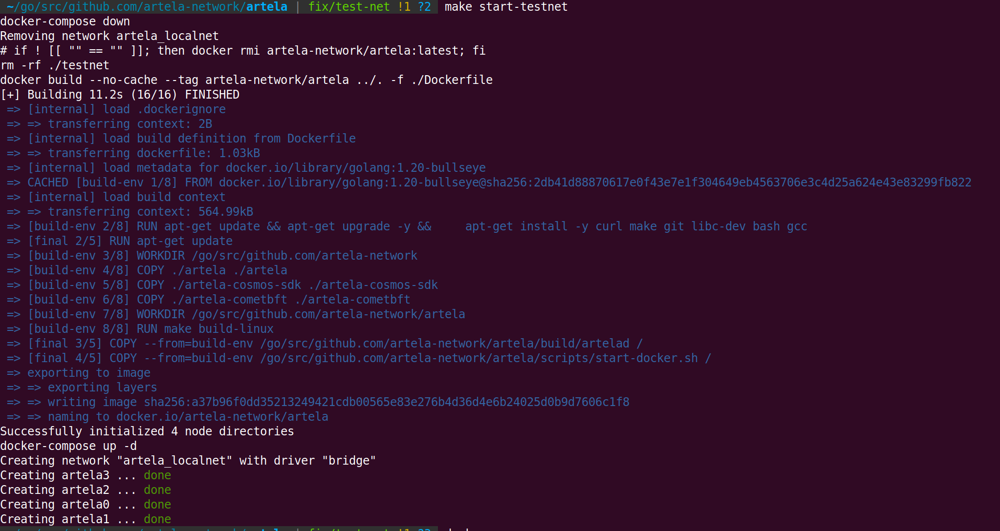

# Setup a Local Devnet

This document aims to guide you in compiling Artela code, configuring, and generating a testnet setup consisting of a minimum of four validators. Subsequently, we will outline how to deploy these configuration and data files to four individual machines.

> Note: open 26656 and 26657 out port for all machines.
>

## 1. Prepare the development tools

**SKIP** this if you have already got your go development environment ready.

```bash
sudo apt-get update
sudo apt-get install -y make gcc
wget https://go.dev/dl/go1.20.3.linux-amd64.tar.gz
sudo rm -rf /usr/local/go && sudo tar -C /usr/local -xzf go1.20.3.linux-amd64.tar.gz
# export PATH=$PATH:/usr/local/go/bin
```

You need to create a folder to store your source files, for example, `/home/user1/go/src`. 

Then, set `/home/user1/go` as the GOPATH by using the following command: `go env -w "GOPATH=/home/user1/go"`. 

This ensures that the necessary Go environment variables are configured correctly.

## 2. Clone and build the code

```bash
cd $GOPATH/src/github.com/artela-network
git clone https://github.com/artela-network/artela-cometbft.git
# git clone https://github.com/artela-network/artela-cosmos-sdk.git
# git clone https://github.com/artela-network/artela.git

cd artela
make clean && make
# find 'artelad' in ./build

# you can copy the binary to $GOPATH/bin
# this is unnecessary if your are going to run testnet in docker
make install
```

## 3. You can either start the testnet in docker or in 4 devices

### Option 1: Start 4-validator testnet in docker

### 1). Prepare your docker and docker-compose (ubuntu/debian)

```bash
sudo apt update
sudo apt install apt-transport-https ca-certificates curl software-properties-common
curl -fsSL https://download.docker.com/linux/ubuntu/gpg | sudo apt-key add -
sudo add-apt-repository "deb [arch=amd64] https://download.docker.com/linux/ubuntu focal stable"

apt-cache policy docker-ce
sudo apt install docker-ce

sudo systemctl status docker
# check if docker is ready
docker run hello-world

# install docker-compose
sudo apt install docker-compose
```

### 2). Start testnet

```bash

cd artela # in your artela root path
make create-testnet
```



- More `make` options about testnet:

| Command | Description |
| --- | --- |
| build-testnet | Build Docker images for the testnet and create a configuration for 4-validator nodes. |
| create-testnet | Remove a previously built testnet, build it again using build-testnet, and start Docker containers. |
| stop-testnet | Stop the running Docker containers for the testnet. |
| start-testnet | Start the previously stopped Docker containers for the testnet. |
| remove-testnet | Stop the Docker containers and remove all components created by the build-testnet command. |

### 3). View the log of Artela node

The log is saved in the `./_testnet/node0/artelad/node.log`, to monitor the log by

```bash
tail -f ./_testnet/node0/artelad/node.log
```

Log of other nodes in

`./_testnet/node1/artelad/node.log`

`./_testnet/node2/artelad/node.log`

`./_testnet/node3/artelad/node.log`

### Option 2: start 4-validator testnet in your device

### 1). Generate 4-validator network configuration

```bash
# in artela root
./build/artelad testnet init-files --chain-id artela_11822-1 --v 4 --output-dir ./testnet --starting-ip-address 172.16.10.2
```

Configuration:

- --chain-id

  With a format of artela_\<NUMBER\>-1, NUMBER could be one of **`11822`**, **`11821`**.

- --v

  The count of validators.

- --output-dir

  Where the configuration of validators will be generated.

- --starting-ip-address

  The nodes will be pre-allocated based on IP addresses incremented in sequence from that starting address. For instance, node 0 will be assigned the `starting-ip-address`, node 1 will be assigned `starting-ip-address + 1`, node 2 will be assigned `starting-ip-address + 2`, and so on. Subsequently, in the node configurations, persistent_peers will be set according to the node's IP address.


### 2). Update ip address of each node

In each node's **`config.toml`**, update the IP addresses of the peers listed under **`persistent_peers`**. You can use the following command for this:

```bash
cd testnet
sed -i 's/172.16.10.3/<your-device-1-ip>/g' node0/artelad/config/config.toml
sed -i 's/172.16.10.4/<your-device-2-ip>/g' node0/artelad/config/config.toml
sed -i 's/172.16.10.5/<your-device-3-ip>/g' node0/artelad/config/config.toml

sed -i 's/172.16.10.2/<your-device-0-ip>/g' node1/artelad/config/config.toml
sed -i 's/172.16.10.4/<your-device-2-ip>/g' node1/artelad/config/config.toml
sed -i 's/172.16.10.5/<your-device-3-ip>/g' node1/artelad/config/config.toml

sed -i 's/172.16.10.2/<your-device-0-ip>/g' node2/artelad/config/config.toml
sed -i 's/172.16.10.3/<your-device-1-ip>/g' node2/artelad/config/config.toml
sed -i 's/172.16.10.5/<your-device-3-ip>/g' node2/artelad/config/config.toml

sed -i 's/172.16.10.2/<your-device-0-ip>/g' node3/artelad/config/config.toml
sed -i 's/172.16.10.3/<your-device-1-ip>/g' node3/artelad/config/config.toml
sed -i 's/172.16.10.4/<your-device-2-ip>/g' node3/artelad/config/config.toml
```

### 3). Update EVM version config

```bash
# in artela/testnet folder
sed -i 's/"extra_eips": \[\]/"extra_eips": \[3855\]/g' node0/artelad/config/genesis.json
sed -i 's/"extra_eips": \[\]/"extra_eips": \[3855\]/g' node1/artelad/config/genesis.json
sed -i 's/"extra_eips": \[\]/"extra_eips": \[3855\]/g' node2/artelad/config/genesis.json
sed -i 's/"extra_eips": \[\]/"extra_eips": \[3855\]/g' node3/artelad/config/genesis.json
```

### 4). Copy the node configuration to your devices

Copy each of the node configurations in `artela/testnet/` to the device.

```bash
scp ./testnet/node0/artelad/* user@your-device-0:~/.artelad/
scp ./testnet/node1/artelad/* user@your-device-1:~/.artelad/
scp ./testnet/node2/artelad/* user@your-device-2:~/.artelad/
scp ./testnet/node3/artelad/* user@your-device-3:~/.artelad/
```

### 4). Download and install `artelad` in your device

### 5). Run node one by one

Start the node in your devices.

```bash
artelad start --pruning=nothing --log_level debug --minimum-gas-prices=0.0001artela --api.enable --json-rpc.api eth,txpool,personal,net,debug,web3,miner --api.enable
```

## 4. The genesis account

In the process of generating the testnet, each validator node has a corresponding EOA (Externally Owned Account) account with the encryption algorithm `eth_secp256k1`, which is written into the `genesis.json` file. Additionally, `5e21 artela` have been deposited into each account. The key.info of each account is stored in

`~/.artelad/config/keyring-test/node<validator_number>.json`.

**KEEP YOUR KEYINFO SECURE.**
