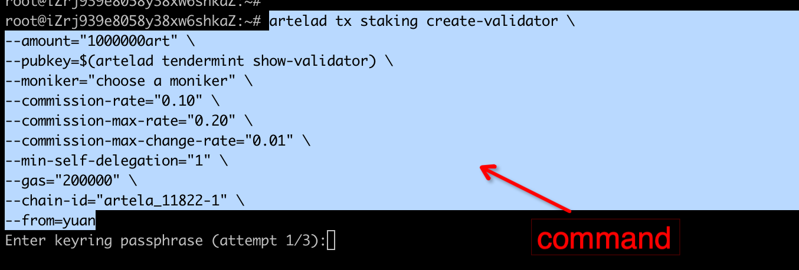

# Validator Guide

## Hardware

To run a validator node, you should run a full node firstly, the following hardware configuration is recommended:

### Supported OS

We officially support macOS and Linux only in the following architectures:

* `darwin/arm64`
* `darwin/x86_64`
* `linux/arm64`
* `linux/amd64`

### Minimum Requirements

To run testnet validator nodes, you will need a machine with the following minimum hardware requirements:

* 8 or more physical CPU cores
* At least 16GB of memory (RAM)
* At least 500GB of SSD disk storage
* At least 100mbps network bandwidth

`Storage size for validators will depend on level of pruning.`

:::warning
Before setting up a validator node, make sure to have completed the [Run a Full Node](../node/run-full-node) guide.
:::

## Step1: Create Your Validator Operator Account
```bash
artelad keys add <account_name>
```


## Step2: Get TestNet Token
You could get ART TestNet Native Token from Discord. 
You could get your account address like this:

```bash
artelad keys show <account_name>
```


## Step3: Create Your Validator

```bash
artelad tx staking create-validator \
--amount="1000000art" \
--pubkey=$(artelad tendermint show-validator) \
--moniker="choose a moniker" \
--chain-id="artela_11820-1" \
--commission-rate="0.10" \
--commission-max-rate="0.20" \
--commission-max-change-rate="0.01" \
--min-self-delegation="1" \
--gas="200000" \
--from=<key_name>
```
* **amount:** how much ART you want to self delegate.
* **moniker:** your validator name, maybe your team name.
* **commission-rate:** commission your validator get from delegator.
* **from:** your validator operator account name.



## Step4: Confirm Your Validator is Running

Your validator is active if the following command returns anything:

```bash
artelad query tendermint-validator-set | grep "$(artelad tendermint show-address)"
```
