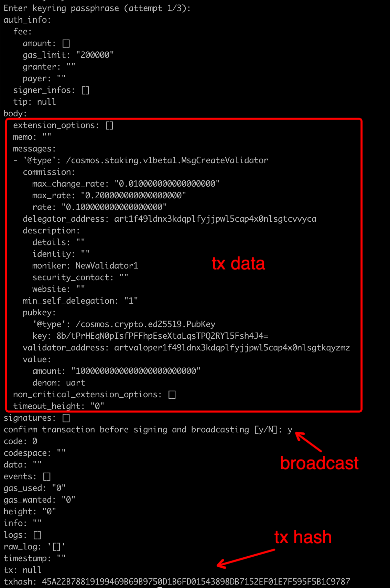
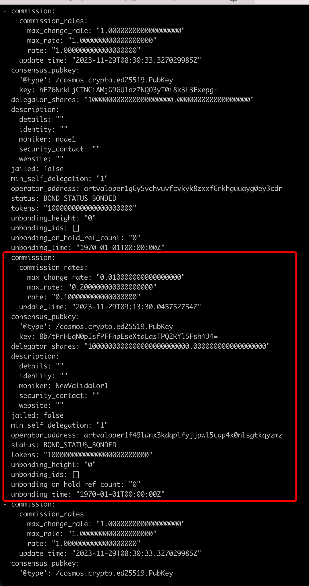
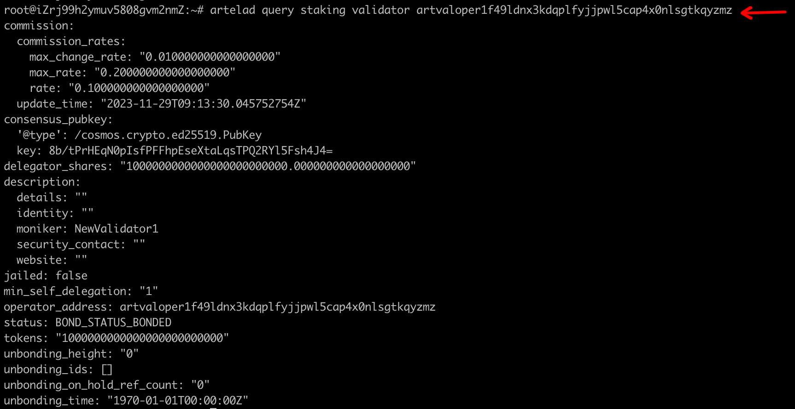
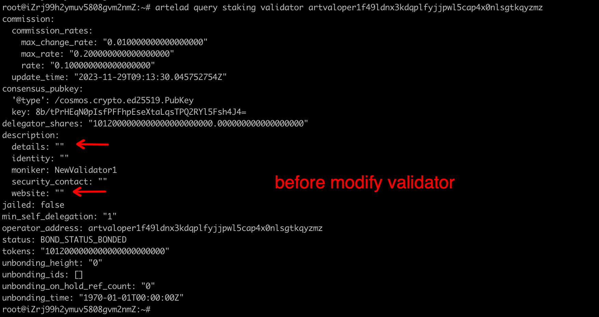
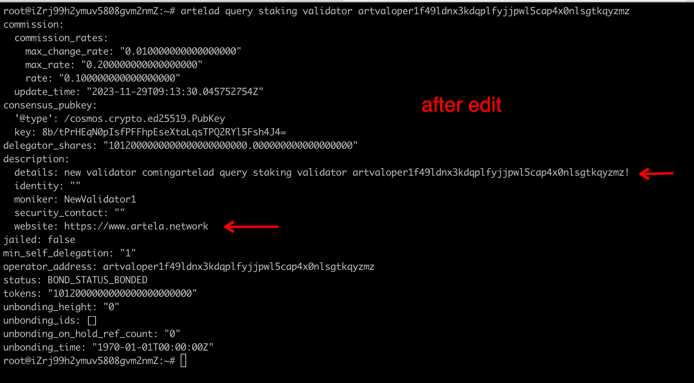

# Validator Guide

:::warning
We suggest you try out joining a public testnet first. Information on how to join the most recent testnet can be found [here](../node/join-testnet).
:::

## Hardware

To run a validator node, you should run a full node firstly, the following hardware configuration is recommended:

### Supported OS

We officially support macOS and Linux only in the following architectures:

* `darwin/arm64`
* `darwin/x86_64`
* `linux/arm64`
* `linux/amd64`

### Minimum Requirements

To run mainnet or testnet validator nodes, you will need a machine with the following minimum hardware requirements:

* 8 or more physical CPU cores
* At least 16GB of memory (RAM)
* At least 500GB of SSD disk storage
* At least 100mbps network bandwidth

`Storage size for validators will depend on level of pruning.`

# Running a Validator

Before setting up a validator node, make sure to have completed the [Joining Mainnet](../node/full-node-setup) guide.

If you plan to use a KMS (key management system), you should go through these steps first: [Using a KMS](kms/kms.md).

## What is a Validator?

[Validators](./overview.md) are responsible for committing new blocks to the blockchain through an automated voting process. A validator's stake is slashed if they become unavailable or sign blocks at the same height. Because there is a chance of slashing, we suggest you read about [Sentry Node Architecture](./validator-faq.md#how-can-validators-protect-themselves-from-denial-of-service-attacks) to protect your node from DDOS attacks and to ensure high-availability.

The following instructions assume you have already [set up a full-node](../hub-tutorials/join-mainnet.md) and are synchonised to the latest blockheight.

## Create Your Validator

:::warning
If you want to become a validator for the Artela's `testnet`, you should learn more about [security](./security).
:::

Your `cosmosvalconspub` can be used to create a new validator by staking tokens. You can find your validator pubkey by running:

```bash
artelad tendermint show-validator
```

:::warning
Don't use more `uatom` than you have!
:::

To create your validator, just use the following command:

```bash
artelad tx staking create-validator \
  --amount=1000000uart \
  --pubkey=$(artelad tendermint show-validator) \
  --moniker="choose a moniker" \
  --chain-id=<chain_id> \
  --commission-rate="0.10" \
  --commission-max-rate="0.20" \
  --commission-max-change-rate="0.01" \
  --gas="auto" \
  --gas-prices="0.0025uart" \
  --from=<key_name>
```
:::info
When specifying commission parameters, the `commission-max-change-rate` is used to measure % _point_ change over the `commission-rate`. E.g. 1% to 2% is a 100% rate increase, but only 1 percentage point.
:::

It's possible that you won't have enough Art to be part of the active set of validators in the beginning. Users are able to delegate to inactive validators (those outside of the active set) using the [Keplr web app](https://wallet.keplr.app/#/cosmoshub/stake?tab=inactive-validators). You can confirm that you are in the validator set by using a third party explorer like [Mintscan](https://www.mintscan.io/cosmos/validators).

## Edit Validator Description

You can edit your validator's public description. This info is to identify your validator, and will be relied on by delegators to decide which validators to stake to. Make sure to provide input for every flag below. If a flag is not included in the command the field will default to empty (`--moniker` defaults to the machine name) if the field has never been set or remain the same if it has been set in the past.

The <key_name> specifies which validator you are editing. If you choose to not include some of the flags below, remember that the --from flag **must** be included to identify the validator to update.

The `--identity` can be used as to verify identity with systems like Keybase or UPort. When using Keybase, `--identity` should be populated with a 16-digit string that is generated with a [keybase.io](https://keybase.io) account. It's a cryptographically secure method of verifying your identity across multiple online networks. The Keybase API allows us to retrieve your Keybase avatar. This is how you can add a logo to your validator profile.

```bash
artelad tx staking edit-validator
  --moniker="choose a moniker" \
  --website="https://cosmos.network" \
  --identity=6A0D65E29A4CBC8E \
  --details="To infinity and beyond!" \
  --chain-id=<chain_id> \
  --gas="auto" \
  --gas-prices="0.0025uart" \
  --from=<key_name> \
  --commission-rate="0.10"
```

:::warning
Please note that some parameters such as `commission-max-rate` and `commission-max-change-rate` cannot be changed once your validator is up and running.
:::

**Note**: The `commission-rate` value must adhere to the following rules:

- Must be between 0 and the validator's `commission-max-rate`
- Must not exceed the validator's `commission-max-change-rate` which is maximum
  % point change rate **per day**. In other words, a validator can only change
  its commission once per day and within `commission-max-change-rate` bounds.

## View Validator Description

View the validator's information with this command:

```bash
artelad query staking validator <account_cosmos>
```

## Track Validator Signing Information

In order to keep track of a validator's signatures in the past you can do so by using the `signing-info` command:

```bash
artelad query slashing signing-info <validator-pubkey>\
  --chain-id=<chain_id>
```

## Unjail Validator

When a validator is "jailed" for downtime, you must submit an `Unjail` transaction from the operator account in order to be able to get block proposer rewards again (depends on the zone fee distribution).

```bash
artelad tx slashing unjail \
 --from=<key_name> \
 --chain-id=<chain_id>
```

## Confirm Your Validator is Running

Your validator is active if the following command returns anything:

```bash
artelad query tendermint-validator-set | grep "$(artelad tendermint show-address)"
```

You should now see your validator in one of the Artelad Network explorers. You are looking for the `bech32` encoded `address` in the `~/.gaia/config/priv_validator.json` file.

## Halting Your Validator

When attempting to perform routine maintenance or planning for an upcoming coordinated upgrade, it can be useful to have your validator systematically and gracefully halt. You can achieve this by either setting the `halt-height` to the height at which you want your node to shutdown or by passing the `--halt-height` flag to `artelad`. The node will shutdown with a zero exit code at that given height after committing
the block.

## Advanced configuration

You can find more advanced information about running a node or a validator on the [CometBFT Core documentation](https://docs.cometbft.com/v0.34/core/validators).

## Common Problems

### Problem #1: My validator has `voting_power: 0`

Your validator has become jailed. Validators get jailed, i.e. get removed from the active validator set, if they do not vote on at least `500` of the last `10,000` blocks, or if they double sign.

If you got jailed for downtime, you can get your voting power back to your validator. First, if you're not using [Cosmovisor](https://docs.cosmos.network/v0.45/run-node/cosmovisor.html) and `artelad` is not running, start it up again:

```bash
artelad start
```

Wait for your full node to catch up to the latest block. Then, you can [unjail your validator](#unjail-validator)

After you have submitted the unjail transaction, check your validator again to see if your voting power is back.

```bash
artelad status
```

You may notice that your voting power is less than it used to be. That's because you got slashed for downtime!

### Problem #2: My `artelad` crashes because of `too many open files`

The default number of files Linux can open (per-process) is `1024`. `artelad` is known to open more than `1024` files. This causes the process to crash. A quick fix is to run `ulimit -n 4096` (increase the number of open files allowed) and then restarting the process with `artelad start`. If you are using `systemd` or another process manager to launch `artelad` (such as [Cosmovisor](https://docs.cosmos.network/v0.45/run-node/cosmovisor.html)) this may require some configuration at that level. A sample `systemd` file to fix this issue is below:

```toml
# /etc/systemd/system/artelad.service
[Unit]
Description=Cosmos Gaia Node
After=network.target

[Service]
Type=simple
User=ubuntu
WorkingDirectory=/home/ubuntu
ExecStart=/home/ubuntu/go/bin/artelad start
Restart=on-failure
RestartSec=3
LimitNOFILE=4096

[Install]
WantedBy=multi-user.target
```








