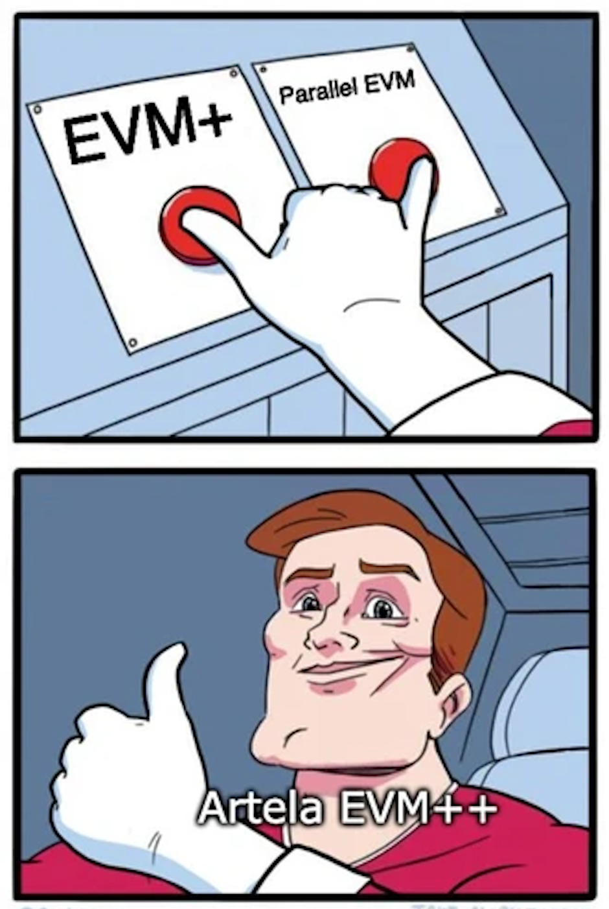

## Introduction

EVM++ is the next-generation EVM execution layer technology. On one hand, it achieves on-chain native extensions through EVM+WASM, unlocking blockchain extensibility; on the other hand, it supports parallel execution, realizing blockchain scalability.

EVM++ is a new pattern that aims to push the boundaries of EVM to adapt to the evolving crypto world: As the productivity and innovation of web2 are being integrated, and useful technologies such as AI, DePIN, and DeFi Security are accelerating their integration into crypto applications. EVM++ represents a new solution that seamlessly connects EVM assets, protocols, and infrastructure, facilitating mass adoption applications and accelerating the integration of crypto with mainstream applications.

## Unlock extensibility by Aspect programming

EVM++ enables a highly extensible EVM network. Utilizing [Aspect programming](/main/Aspect-Programming/Aspect), Artela blockchain introduces a WASM virtual machine on the EVM-compatible network that can interoperate with each other, enabling dynamic addition and execution of on-chain extension programs. So, EVM++ empowers developers to build high-performance protocols, modular dApps, and customize underlying features for specific scenarios.

During DevNet and Public Testnet, creative developers from Artela’s community have explored the potential of the EVM++ network, which led to imaginative use cases:

- Utilizing WASM as an [on-chain co-processor](https://www.odaily.news/en/post/5191903) to facilitate the execution of AI-agent algorithms and other high-performance modules directly on the blockchain, while ensuring seamless interoperability with the EVM system.
- [On-chain AI agents](https://github.com/cellulalifegame/Pac-Man-Artela-Aspect) that participate in the autonomous worlds and enable truly programmable [on-chain NPCs](https://artela.network/blog/aspect-case-on-chain-npc-for-autonomous-world-game) that can interact with users.
- Opt-in [on-chain security](https://artela.network/blog/eliminate-reentrancy-attacks-with-on-chain-runtime-protection) modules that can execute in real-time, allowing DeFi protocols to identify and revert suspicious transactions instantly.

## Unlock scalability by parallel and elastic execution

Artela's network not only implements basic parallel EVM but also addresses the challenges of parallel execution under EVM + Aspect, which is an extension program that runs on the WASM virtual machine and can be called during the transaction's lifecycle.

Artela will also leverage parallel features and combine them with elastic computing to achieve elastic block space, a dynamic mechanism that allows dApps to maximize the benefits of parallel execution.

### **Parallel EVM** in a nutshell

Artela's horizontally scalable architecture is designed around parallel execution, ensuring network node computing power is scalable through elastic computing, ultimately achieving elastic block space.

- **Parallel Execution:** Transactions on Artela can be executed in parallel. Artela network groups transactions for parallel execution based on transaction dependency conflict analysis.
- **Elastic Computing:** Validator nodes support horizontal scaling, where the network automatically adjusts the computation node of validators based on the current network load or subscription. The scaling process is coordinated by an elastic protocol, ensuring sufficient elastic computation nodes in the consensus network.
- **Elastic Block Space:** Based on elastic computing, in addition to expanding the public block space, large-scale dApps with independent block space requirements can apply for dedicated elastic block space in the network.

## Learn more

* [Aspect programming](/main/Aspect-Programming/Aspect)
* [Parallel execution](/main/Artela-Blockchain/Parallel%20execution)
* [Elastic block space](/main/Artela-Blockchain/Elastic%20Block%20Space)