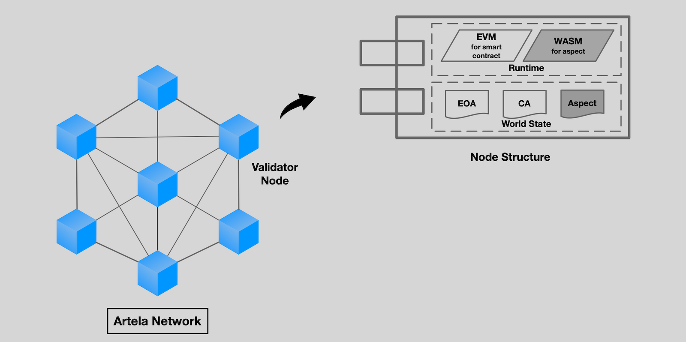
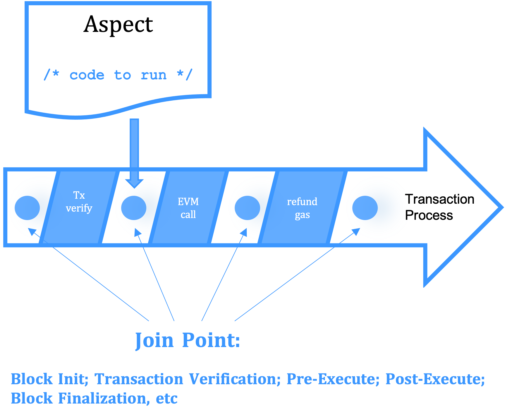

# Aspect

<!-- ##  What is Aspect -->

In Artela, we define a new programmable module to work as Native Extension, called Aspect.

The name “Aspect” is inspired by Aspect-oriented Programming. Aspect can tap into the complete API set of the base layer, and inject extended logic into specific join points during a transaction's lifecycle.

Aspect integrates customized functionality into the blockchain base layer, working synergistically with smart contracts to enhance dApp modularity and functionality.

## Principle of Aspect

<!-- 

 -->
 

<!-- Developers can utilize Aspect SDK to access base layer API for building Aspects.  -->

### Building Process
1. Aspect source code is compiled into WASM bytecode.  
2. Aspect bytecode is deployed to the Artela network through a deployment transaction. 
3. After the consensus process, Aspect bytecode will be written to the blockchain's world state and synchronized to all nodes on the network. 
4. Smart contract owner executes a binding transaction, specifying that it needs to be combined with the Aspect. 
5. Subsequent transactions calling the smart contract will be processed by the Aspect.

### Join Points

Aspect needs to specify Join Points, which are the positions where Aspects are executed throughout the transaction processing lifecycle. Join Points includes Block Init, Transaction Verification, Pre Execute, Post Execute, Block Finalize and etc.

<!-- 

 -->
 

### Core Characteristics

- **Security isolation:** Aspects are executed within a secure sandbox environment that operates independently from the base layer. This isolation ensures that the execution of an Aspect does not compromise the security and availability of the base layer. Furthermore, Aspects are securely isolated from each other, meaning that the execution of one Aspect does not interfere with or affect the execution of other Aspects.
- **Composability:** Developers can bind smart contracts with Aspects to enable additional functionality. When a transaction calls a smart contract, it passes through the associated Aspects, allowing for additional processing capabilities to be applied. Aspects can be combined with multiple smart contracts seamlessly.

## Aspect Capabilities

Aspect, as an actual technical implementation of Native Extension, serves as a complement rather than a substitute for smart contracts.

What sets Aspects apart from smart contracts is their ability to fine-tailor the entire lifecycle of a transaction and interact with the base processing context. The following are a few examples of what Aspects can do:

- Customize the transaction validation process.
- Integrate middleware natively.
- Construct blocks with customized rules.
- Access the execution context and create reliable asynchronous tasks.

## Aspect Benefits

Aspects can enhance the functionality of dApps and support the construction of complex protocols in a modular way, simplifying complexity. The advantages are as the following:

- **Enhanced functionalities:** Developers can leverage Aspect to implement system-level functionalities such as security checks, off-chain data synchronization, and reliable scheduled tasks. This expands the functionality and potential use cases of dApps by adding features that were traditionally challenging to implement solely within the confines of smart contracts.
- **Enhanced transaction lifecycle management:** Artela supports extension join points throughout the transaction lifecycle. Before/after transaction execution, Aspects can add customized process logic into transactions, giving Aspects control over the entire lifecycle of the transaction.
- **Reduced code complexity:** For complex processing logic, developers can choose to host it on a public Aspect. This not only reduces the complexity of decentralized application code but also saves deployment costs by reducing byte code size.
- **Increased maintainability:** Developers can separate the functional and non-functional features of a dApp with Aspect to achieve logic decoupling, making the maintenance and scaling of the dApp easier.
- **Improved security:** Developers can implement more accurate and efficient security check strategies with Aspects, such as malicious transaction identification and pre/post-execution state data verification, enhancing the overall security of the dApp.
- **Customization without sacrificing composability:** Aspects achieve full customization without sacrificing dApp interoperability and composability.
