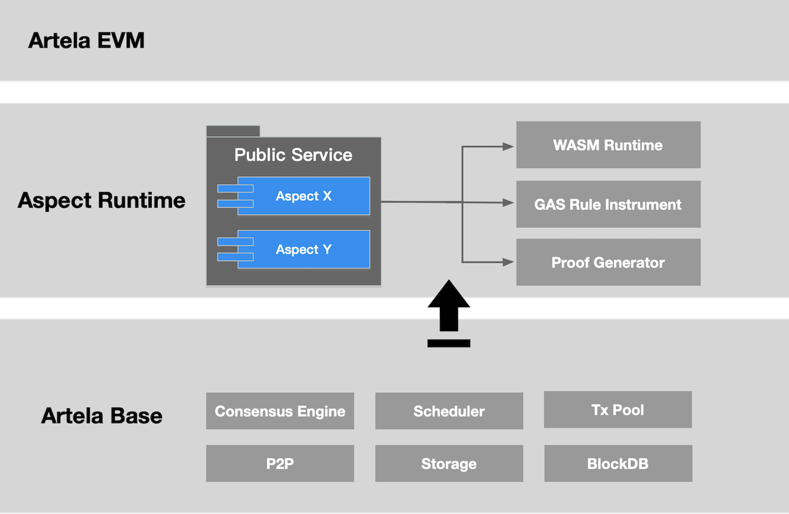
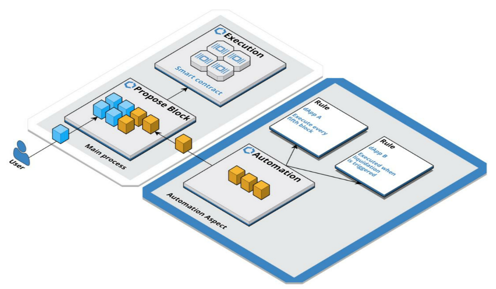

# Public Service

## Introduction

> **Aspect can be provided as Public Service to derive value directly from its usage by versatile smart contracts.**

From the perspective of public goods developers, they can build their public goods as Aspects and derive value directly from their usage. When dApps interact with public goods Aspects, they generate usage. As a reward, public goods developers are eligible to receive tokens from Artela ecosystem according to the economic incentive model.

From the perspective of application developers, they can build their dApps simply by integrating public service Aspects, which greatly reduces costs and improves efficiency. 

As more public service Aspects are developed, both developers and ecosystem will benefit from it.

The principle of Public Service:

<!-- 

 -->
 

---

## Use Case

1. Enterprise-grade on-chain risk management
    
  Artela enables Real-time On-chain Risk Control by security Aspect.  Without Aspect, current solutions like auditing are all peripheral off-chain risk management.
  
  Enterprise-level risk control logic can be deployed on-chain through security Aspects. When a transaction triggers a risk control policy, Aspects can timely identify and suspend the risky transaction.
  
  Security Aspects can be flexibly plugged in/out and combined with dApps.

<!-- 

 -->
 

2. On-chain Automation Middleware Service

  Aspect can be deployed as a middleware to enable the implementation of reliable on-chain automated execution. 

  Currently, automated execution can only be realized by off-chain entities with possible trade-offs like composability and trust.

  Automation Aspects run as extensions of the base layer to hold native-level composability and can be supported by shared validator sets. It unlocks more possibilities for DeFi, such as JIT LP, transaction performance protection, transaction reversion, dApps extractable value, etc.
<!-- 

 -->

